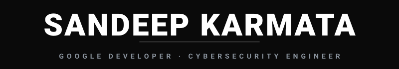

<div align="center">

<!-- ═══════════════════════════════════════════════════════════ -->
<!-- 🌊 ANIMATED WAVING HEADER                                  -->
<!-- ═══════════════════════════════════════════════════════════ -->


<!-- ═══════════════════════════════════════════════════════════ -->
<!-- 🎯 HERO: ANIMATED NAME + SUBTITLE                         -->
<!-- ═══════════════════════════════════════════════════════════ -->
<a href="https://github.com/Sandeep6135">
  
</a>

<br/>

<!-- ═══════════════════════════════════════════════════════════ -->
<!-- 💊 FLOATING ROLE PILLS                                     -->
<!-- ═══════════════════════════════════════════════════════════ -->


<br/><br/>

<!-- ═══════════════════════════════════════════════════════════ -->
<!-- 🏷️ CYBER MATERIAL BADGES                                  -->
<!-- ═══════════════════════════════════════════════════════════ -->
<p>
  &nbsp;
  <a href="https://gssoc.girlscript.tech/"></a>&nbsp;
  &nbsp;
  &nbsp;
  <a href="https://youtube.com"></a>&nbsp;
  <a href="https://open.spotify.com"></a>
</p>

</div>

<!-- ═══════════════════════════════════════════════════════════ -->
<div align="center"></div>
<!-- ═══════════════════════════════════════════════════════════ -->

<br/>

<!-- ═══════════════════════════════════════════════════════════ -->
<!-- 💻 SECTION: WHOAMI                                         -->
<!-- ═══════════════════════════════════════════════════════════ -->
<div align="center">
  
</div>

<br/>

<div align="center">

```js
// sandeep@kali:~$ whoami
const sandeep = {
    role:       "Cybersecurity Engineer & Creative Technologist",
    education:  "B.Tech CSE (Cyber Security) — Parul University",
    internship: "Cyber Security Team Lead @ Infotact Solutions ✅",
    devsecops:  "SAST/DAST & CI/CD Security Automation 🛠️",
    openSource: "GSSoC 2026 — Open Source + AI Agents Track",
    studio:     "Founder — Takshashila Studios",
    artist:     "Independent Music Artist — Sanzaar",
    philosophy: "I don't just find vulnerabilities — I build the tools that do."
};
```

</div>

<br/>

<!-- ═══════════════════════════════════════════════════════════ -->
<div align="center"></div>
<!-- ═══════════════════════════════════════════════════════════ -->

<br/>

<!-- ═══════════════════════════════════════════════════════════ -->
<!-- 🛠️ SECTION: CURRENTLY BUILDING                            -->
<!-- ═══════════════════════════════════════════════════════════ -->
<div align="center">
  
</div>

<br/>

<div align="center">
<table>
<tr>
<td width="33%" valign="top">

```yaml
# ─── GSSoC 2026 ──────────────
Role: "Open Source Contributor"
Focus: ["Security",
        "AI Agents"]
Track: "Open Source + AI Agents"
```

</td>
<td width="33%" valign="top">

```yaml
# ─── TAKSHASHILA STUDIOS ──────
Role: "Founder & Producer"
Services: ["Music Production",
           "Video Editing",
           "Visual Direction"]
Tagline: "Compose. Code. Command."
```

</td>
<td width="33%" valign="top">

```yaml
# ─── CODEFORTRESS CI ─────────
Type: "DevSecOps Pipeline"
Tools: ["SonarQube SAST",
        "OWASP ZAP DAST",
        "TruffleHog",
        "DefectDojo"]
Focus: "Automated Shift-Left"
```

</td>
</tr>
</table>
</div>

<br/>

<!-- ═══════════════════════════════════════════════════════════ -->
<div align="center"></div>
<!-- ═══════════════════════════════════════════════════════════ -->

<br/>

<!-- ═══════════════════════════════════════════════════════════ -->
<!-- 💼 SECTION: EXPERIENCE & JOURNEY                          -->
<!-- ═══════════════════════════════════════════════════════════ -->
<div align="center">
  
</div>

<br/>

<div align="center">
<table>
<tr>
<td width="50%">

```yaml
# ─── PROFESSIONAL ──────────
Company:  "Infotact Solutions"
Role:     "Cyber Security Analyst"
Focus:    [VAPT, Web Security,
           Automation, IR Support]
Status:   "✅ Completed — Dec 2025 to Mar 2026"
```

</td>
<td width="50%">

```yaml
# ─── ACHIEVEMENTS ──────────
Hackathons:
  - "⚡ FrostHack"
  - "⚡ PU Code Hackathon 3.0"
Projects:
  - "🔧 Security Automation"
  - "🔧 Vuln Scanners"
```

</td>
</tr>
</table>

<br/>

<a href="https://tryhackme.com/p/Sandeep6135"></a>&nbsp;
<a href="https://leetcode.com/Sandeep6135"></a>&nbsp;
<a href="https://www.hackthebox.com/"></a>&nbsp;
<a href="https://gssoc.girlscript.tech/"></a>&nbsp;


</div>

<br/>

<!-- ═══════════════════════════════════════════════════════════ -->
<div align="center"></div>
<!-- ═══════════════════════════════════════════════════════════ -->

<br/>

<!-- ═══════════════════════════════════════════════════════════ -->
<!-- ⚡ SECTION: CYBER ARSENAL                                  -->
<!-- ═══════════════════════════════════════════════════════════ -->
<div align="center">
  
  
  <br/><br/>
  
  <p>
    
  </p>
  
  <br/>

  <p>
    &nbsp;
    &nbsp;
    &nbsp;
    &nbsp;
    &nbsp;
    
  </p>
</div>

<br/>

<!-- ═══════════════════════════════════════════════════════════ -->
<div align="center"></div>
<!-- ═══════════════════════════════════════════════════════════ -->

<br/>

<!-- ═══════════════════════════════════════════════════════════ -->
<!-- 🎵 SECTION: CREATIVE CIPHER                               -->
<!-- ═══════════════════════════════════════════════════════════ -->
<div align="center">
  
</div>

<br/>

<div align="center">
<table>
<tr>
<td width="50%" valign="top">

```yaml
# ─── SANZAAR — Independent Artist ──
Artist:      "Sanzaar"
Instruments: 10+ including Drums, Trumpet,
             Keyboard, Guitar, Tabla, Cajon
Distribution: DistroKid → All Major Platforms
Channel:     "Official Artist Channel — YouTube"
Genre:       "Multi-genre Original Compositions"
```

</td>
<td width="50%" valign="top">

```yaml
# ─── TAKSHASHILA STUDIOS — Creative Production ──
Studio:    "Takshashila Studios"
Services:  ["Music Production",
            "Video Editing",
            "Visual Storytelling",
            "Creative Direction"]
Identity:  "Where creativity meets craft"
Tagline:   "Create. Compose. Command."
```

</td>
</tr>
</table>

<br/>


</div>

<br/>

<!-- ═══════════════════════════════════════════════════════════ -->
<div align="center"></div>
<!-- ═══════════════════════════════════════════════════════════ -->

<br/>

<!-- ═══════════════════════════════════════════════════════════ -->
<!-- 🎧 SECTION: NOW PLAYING                                    -->
<!-- ═══════════════════════════════════════════════════════════ -->
<div align="center">
  

  <br/><br/>

  <a href="https://open.spotify.com"></a>&nbsp;
  <a href="https://youtube.com"></a>&nbsp;
  <a href="https://music.apple.com"></a>

  <br/><br/>

  &nbsp;
  &nbsp;
  
</div>

<br/>

<!-- ═══════════════════════════════════════════════════════════ -->
<div align="center"></div>
<!-- ═══════════════════════════════════════════════════════════ -->

<br/>

<!-- ═══════════════════════════════════════════════════════════ -->
<!-- 📊 SECTION: GITHUB COMMAND CENTER                         -->
<!-- ═══════════════════════════════════════════════════════════ -->
<div align="center">
  
  
  <br/><br/>

  <!-- 🏆 TROPHIES -->
  

  <br/>
  
  
  
  
  <br/>
  
  
</div>

<br/>

<!-- ═══════════════════════════════════════════════════════════ -->
<div align="center"></div>
<!-- ═══════════════════════════════════════════════════════════ -->

<br/>

<!-- ═══════════════════════════════════════════════════════════ -->
<!-- 🐍 SECTION: CONTRIBUTION SNAKE                            -->
<!-- ═══════════════════════════════════════════════════════════ -->
<div align="center">
  
  
  <br/><br/>
  
  <picture>
    <source media="(prefers-color-scheme: dark)" srcset="https://raw.githubusercontent.com/Sandeep6135/Sandeep6135/output/github-snake-dark.svg" />
    <source media="(prefers-color-scheme: light)" srcset="https://raw.githubusercontent.com/Sandeep6135/Sandeep6135/output/github-snake.svg" />
    
  </picture>
</div>

<br/>

<!-- ═══════════════════════════════════════════════════════════ -->
<div align="center"></div>
<!-- ═══════════════════════════════════════════════════════════ -->

<br/>

<!-- ═══════════════════════════════════════════════════════════ -->
<!-- 🚀 SECTION: ESTABLISH CONNECTION                          -->
<!-- ═══════════════════════════════════════════════════════════ -->
<div align="center">
  
  
  <br/><br/>
  
  <a href="mailto:Skyline.6135@gmail.com"></a>&nbsp;
  <a href="https://linkedin.com/in/sandeepkarmata"></a>&nbsp;
  <a href="https://github.com/Sandeep6135"></a>
  
  <br/><br/>
  
  
  
  <br/><br/>
  
  

</div>

<br/>

<!-- ═══════════════════════════════════════════════════════════ -->
<!-- 🌊 ANIMATED WAVING FOOTER                                 -->
<!-- ═══════════════════════════════════════════════════════════ -->

